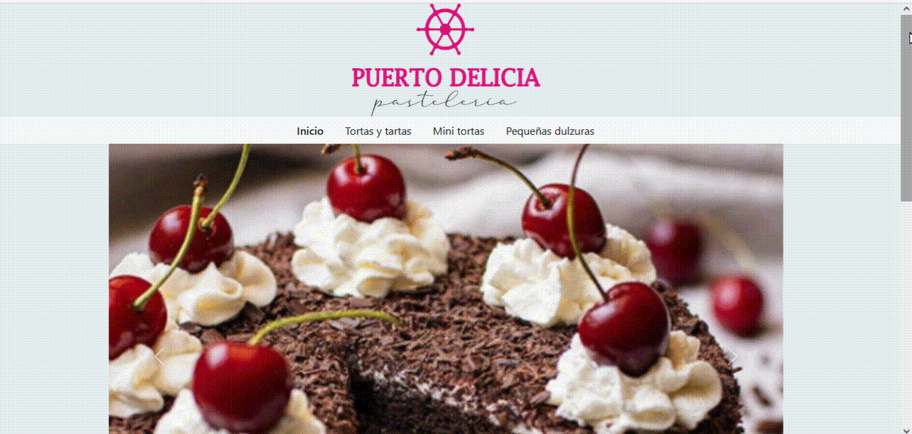

# Proyecto Final del Curso de REACT JS de CODERHOUSE

## E-commerce project

### Descripción del proyecto:

`Proyecto final` para el curso REACT JS de CODERHOUSE. Se desarrolló una aplicación de e-commerce para vender productos de la pastelería ficticia **Puerto Delicia**. Los items y las órdenes de compras son almacenados en colecciones de `Firestore`. El usuario puede ingresar, navegar por los productos y ver sus detalles. En la página principal se sugieren algunos ítems del catálogo. También se brinda un menú con la categoría de los productos que permite filtrarlos según la elección del navegante. Desde su detalle se muestra una descripción, precio y se permite agregarlos al carrito de compras. En la vista del mismo se listan los productos seleccionados y el precio total de la compra. Luego se deben completar los datos del cliente para guardar la compra con el detalle generado y al completar exitosamente estos pasos se obtiene el número de orden asignado.

### Pasos para correr el proyecto:

- Clonar el proyecto en su máquina local

```batch
 git clone https://github.com/ingridlch/EntregaLopezChiappesoni.git
```

- Abrir el proyecto con algún editor de código
- Desde el directorio del proyecto instalarlo con:

```batch
 npm install
```

- Inicializar el servidor de desarrollo

```batch
 npm run dev
```

### Navegabilidad de la aplicación:


